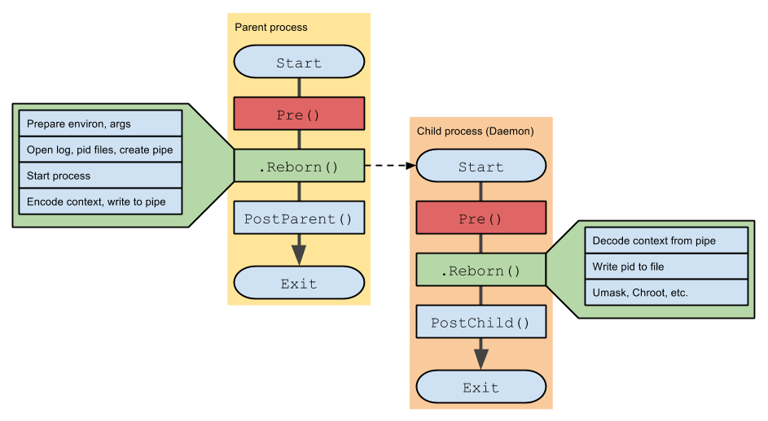

# go-daemon [](https://travis-ci.org/sevlyar/go-daemon) [](https://godoc.org/github.com/sevlyar/go-daemon)
 
Library for writing system daemons in golang.

## Installation

	go get github.com/sevlyar/go-daemon

## Idea

```go
func main() {
	Pre()

	context := new(Context)
	child, _ := context.Reborn()

	if child != nil {
		PostParent()
	} else {
		defer context.Release()
		PostChild()
	}
}
```



## History

### 14.01.12
* released new major version, old version moved to github.com/sevlyar/go-daemon/oldapi

